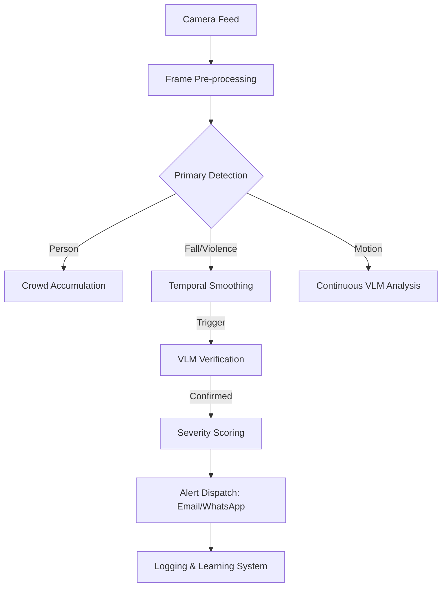

# CEMSS Project Report - Campus Event management and Surveillance System

## 1. Dataset Overview

The CEMSS system utilizes a hybrid dataset approach to ensure high accuracy across diverse detection tasks:

* **Person & Crowd Detection**: Trained on the **JHU-CROWD++** and **ShanghaiTech** datasets, providing robust performance in dense environments.
* **Fall Detection**: Leverages the **UR Fall Detection Dataset** and specialized skeletal pose data for high-precision posture analysis.
* **Violence Detection**: Utilizes a custom dataset derived from GitHub open-source repositories (94.3% accuracy), focused on physical altercations and weapon identification.
* **Phone Detection**: Trained on a custom COCO-derived dataset optimized for small object detection near the head region.
* **Self-Learning Data**: The system autonomously generates a verification dataset using VLM (Vision Language Model) analysis of edge cases, stored in `learning_data/verification_images`.

## 2. Methodology

CEMSS implements a multi-layered AI architecture:

1. **Primary Detection Layer (YOLO)**: Real-time object detection using YOLOv8/v11 models optimized for speed and edge deployment.
2. **Verification Layer (VLM)**: Detections are verified using Vision Language Models (MiniCPM-V) to eliminate false positives through semantic scene understanding.
3. **Skeletal Analysis**: A secondary fall detection system checks for specific keypoint transitions (Standing → Fallen) using pose estimation.
4. **Temporal Smoothing**: A sliding window algorithm ensures that alerts are only triggered for persistent events, reducing noise from momentary glitches.
5. **Multi-Model Fusion**: Confidence boosting logic where related detections (e.g., Person + Fall) increase the overall alert severity.

## 3. Workflow

The system follows a synchronized processing pipeline:

## 4. Feature Enhancement

Recent major enhancements include:

* **Conversational VLM Assistant**: A chatbot that can "see" and "describe" live feeds, allowing users to ask natural language questions about security events.
* **Shared VLM Instance (Singleton)**: Optimized resource management where background tasks and user queries share a single VLM model to save GPU/CPU memory.
* **Autonomous Threshold Adjustment**: The system automatically adjusts YOLO confidence thresholds based on VLM verification results (True Positives vs. False Positives).
* **Adaptive Frame Skipping**: Dynamic processing rates based on system load (implemented v11.2).

## 5. Literature Review

Research in AI surveillance has matured significantly, as summarized below:

* **Real-time Object Detection**: YOLO (You Only Look Once) remains the gold standard for real-time applications. Recent literature emphasizes the evolution from YOLOv5 to YOLOv8, showing significant improvements in mAP (mean Average Precision) for small objects and dense crowds [1][3].
* **Hybrid Vision-Language Models**: The integration of VLMs like CLIP and LLaVA allows surveillance systems to move beyond simple bounding boxes to semantic understanding. Research suggests that hybrid architectures provide "open-vocabulary" detection capabilities unreachable by traditional detectors [10][11].
* **Automated Fall Detection**: Video-based fall detection is transitioning from simple background subtraction to complex 3D skeletal tracking. Modern systems use CNN-RNN combinations to analyze temporal patterns of falls with high accuracy [14][15].
* **Violence Detection in Surveillance**: Literature highlights the challenge of occlusion. Recent studies use "feature fusion" techniques—combining weapon detection with human pose anomalies—to achieve higher reliability in public spaces [8][9].

## 6. Conclusion

The CEMSS project demonstrates that a modern surveillance system must be more than just a camera recorder. By merging real-time object detection (YOLO) with high-level semantic reasoning (VLM) and local LLM-powered interaction, CEMSS provides a comprehensive, privacy-first security solution. Future development will focus on multi-camera spatial correlation and decentralized edge deployment.

---

### References

* [1] Real-time Object Detection Evolution (IRJET)
* [10] DigitalOcean: The Rise of VLMs in Computer Vision
* [14] MDPI: Video-based Fall Detection Survey
